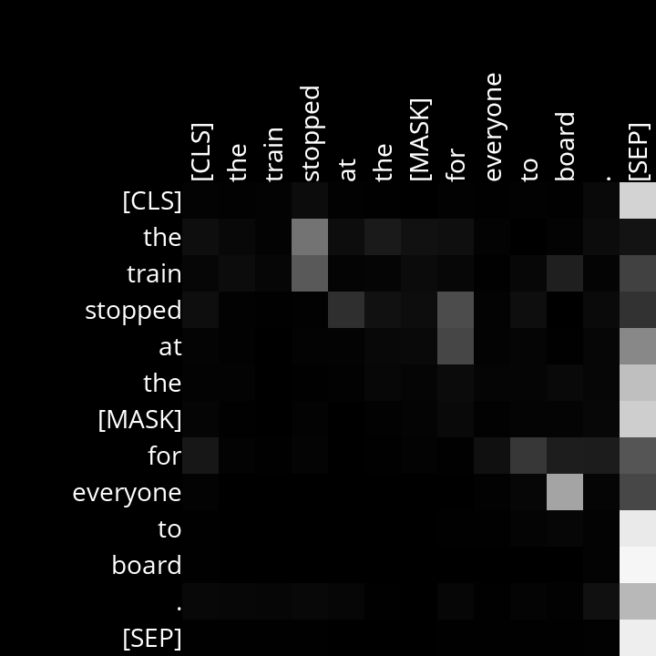
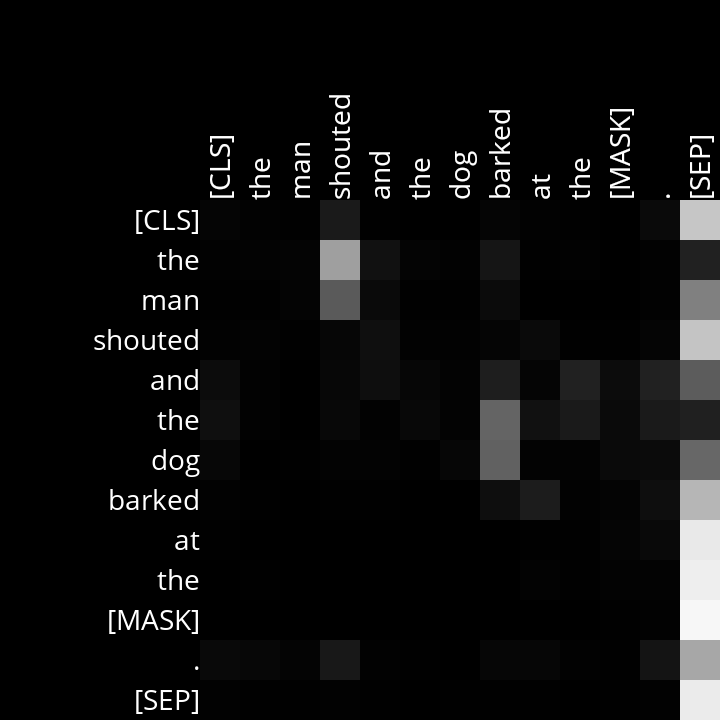
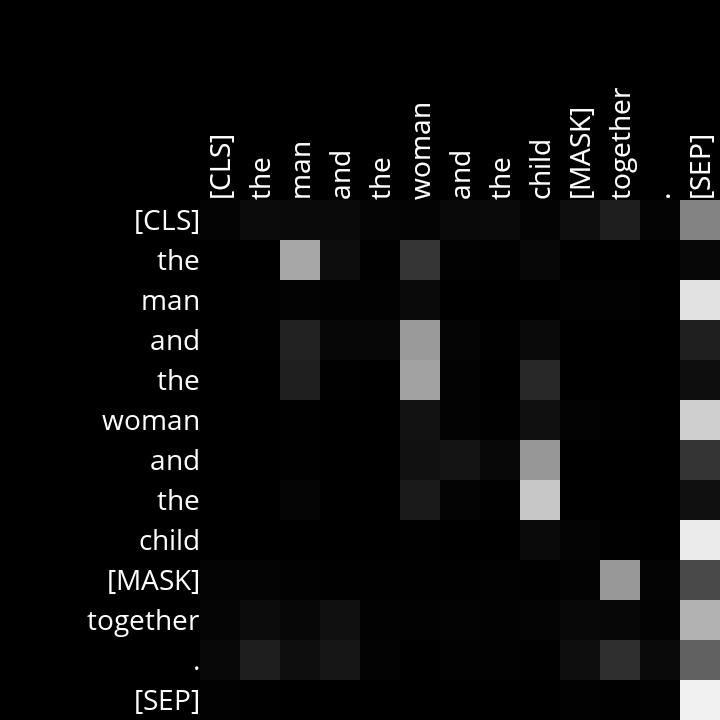
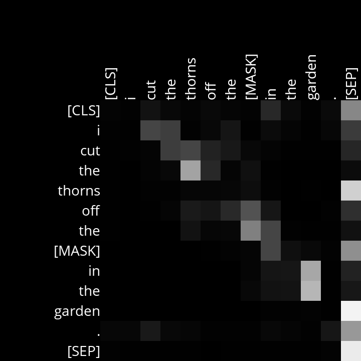
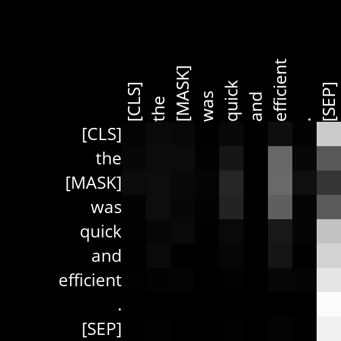
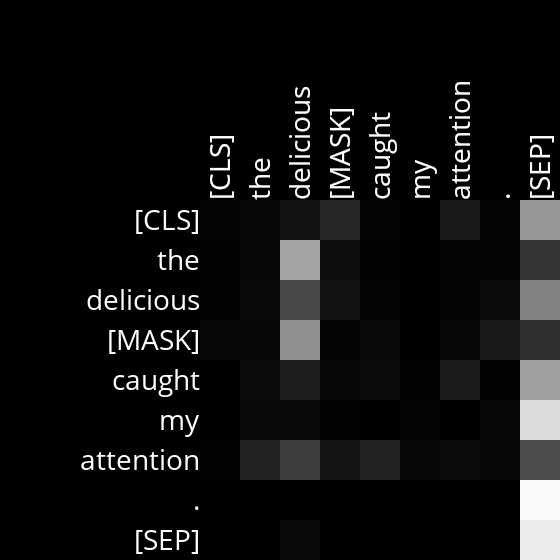

# Analysis

## Layer 6, Head 12

This head has paired noun phrases with verbs. Correctly identifying the pairs when multiple noun-verb combinations exist.

Example Sentences:
- The train stopped at the [MASK] for everyone to board.
- The man shouted and the dog barked at the [MASK].

## Layer 8, Head 11

This head pays attention to the noun that the determiner it is currently on, corresponds to. It also seems to pay a high degree of attention to the separator when on each noun in a clause.

Example Sentences:
- The man and the woman and the child [MASK] together.
- I cut the thorns off the [MASK] in the garden.

## Layer 10, Head 8

This head pays attention to the adjectives in the clause. Usually keeping it's attention on them at every token. Especially noticeable when there are multiple adjectives.

Example Sentences:
- The [MASK] was quick and efficient.
- The delicious [MASK] caught my attention.

